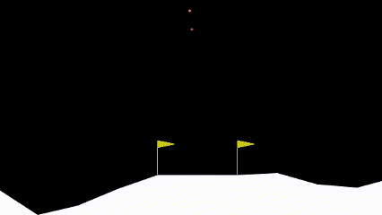

# Lunar Lander

## Problema

Este é um ambiente do clássico problema de otimização de trajetória de foguete.
De acordo com o
[princípio máximo de Pontryagin](https://pt.wikipedia.org/wiki/Princ%C3%ADpio_m%C3%ADnimo_de_Pontryagin),
é ideal ligar o motor a toda velocidade ou desligá-lo. Por esta razão este
ambiente possui ações discretas: ligar ou desligar os motores.

A plataforma de pouso está sempre nas coordenadas (0, 0). As coordenadas são os
dois primeiros números do vetor de estado. É possível pousar fora da plataforma
de pouso. O combustível é infinito, então um agente pode aprender a voar e
pousar na primeira tentativa.

## Espaço de Ação

O espaço de observação é discreto com 4 ações distintas. Dentre elas:

- 0: Fazer nada;
- 1: Dispara o motor de orientação à esquerda;
- 2: Dispara o motor de propulsão principal;
- 3: Dispara o motor de orientação à direita.

## Espaço de observação

O estado é um vetor de 8 dimensões:

- As coordenadas do módulo de pouso em x e y;
- as velocidades lineares em x e y;
- o ângulo da espaçonave em relação ao solo;
- a velocidade angular;
- e dois booleanos que representam se cada perna está em contato com o solo.

## Lunar Lander em um estágio intermediário de aprendizado

## Lunar Lander em um estágio final de aprendizado

 

